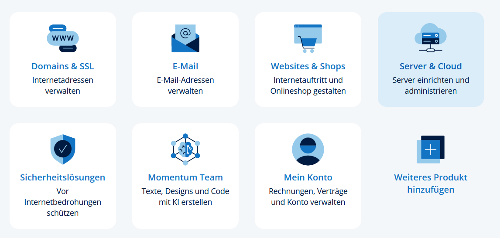
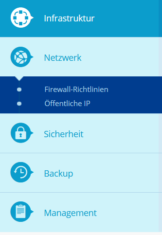

# Einsteiger-Guide

## 0. Benötigte Accounts und Services
1. **Usenet-Anbieter**: z.B. Newshosting, Easynews, Eweka. Ohne Anbieter kann man nichts herungerladen
  - *Tipp:* Deutsche Nutzer sollten auf [Mydealz](https://www.mydealz.de/search?q=usenet) nach Angeboten für Usenet-Anbieter suchen.
2. **Indexer/API Zugang**: Wähle eine der folgenden Optionen:
   - Nutze die **integrierte Easynews-Bridge** (verwendet deinen Easynews-Benutzernamen/Passwort). Das ist hauptsächlich für englischen Content.
   - [SceneNZBs](https://scenenzbs.com/) ist mit Abstand die beste Option für deutschen Content.
   - *Optional:* Lasse **Prowlarr oder NZBHydra** laufen, wenn du diese bevorzugst; sie sind für diesen Guide jedoch nicht mehr erforderlich.
3. **DuckDNS Account (optional)**: Nur erforderlich, wenn du öffentlichen HTTPS-Zugriff wünschst(Streaming von außerhalb deines Heimnetzwerkes). Für Streaming im Heimnetzwerk (LAN) kannst du dies überspringen und die IP deines Servers nutzen (z. B. `http://192.168.1.50:7000`). Falls du Fernzugriff benötigst, registriere dich bei [DuckDNS](https://www.duckdns.org), erstelle eine Subdomain (z. B. `mystreamer`) und verweise sie auf die statische IP deines VPS.
   - Das sollte [so aussehen](https://imgur.com/a/CHxhRzx).

## 1. VPS mieten und einloggen

Für eine günstige Option sollte das [IONOS](https://www.ionos.de/server/vps) VPS-S Paket mehr als ausreichen. Richte es mit Ubuntu ein.

Logge dich mit deinen Zugangsdaten ein und klicke auf Server & Cloud



Im VPS-Dashboard wähle Netzwerk und klick auf "Firewall-Richtlinien"



Füge nun eingehende Regeln (Inbound Rules) für die **Ports 80, 443, 7000, 3000 und 22 (TCP)** hinzu. Falls du dich entschieden hast, einen Manager (Prowlarr/Hydra) zu nutzen, füge auch **Port 9696** hinzu.

Du benötigst das root-Passwort deines VPS. Dieses kannst du aufrufen, in dem du deinen VPS anklickst und unter den Zugangsdaten nach dem Initial-Passwort suchst.

Logge dich nun in deinen VPS ein:
```bash
ssh root@deine-vps-ip
```

Sobald du aufgefordert wirst, gib das root-Passwort ein, das du im IONOS-Dashboard gefunden hast.


## 2. Installation von Docker und Docker Compose

```bash
sudo apt update
sudo apt install -y ca-certificates curl gnupg lsb-release
sudo install -m 0755 -d /etc/apt/keyrings
curl -fsSL https://download.docker.com/linux/ubuntu/gpg | sudo gpg --dearmor -o /etc/apt/keyrings/docker.gpg
echo "deb [arch=$(dpkg --print-architecture) signed-by=/etc/apt/keyrings/docker.gpg] https://download.docker.com/linux/ubuntu $(lsb_release -cs) stable" | sudo tee /etc/apt/sources.list.d/docker.list
sudo apt update
sudo apt install -y docker-ce docker-ce-cli containerd.io docker-buildx-plugin docker-compose-plugin
sudo usermod -aG docker $USER
newgrp docker
```

## 3. Ordner und Secrets anlegen

Führe folgenden Befehl aus:

```bash
id
```

Notiere die `uid=` und `gid=` Werte, die ausgegeben werden und verwende sie überall dort wo in der Anleitung `PUID` und `PGID` erwähnt werden.

```
mkdir -p ~/usenetstack/{nzbdav,usenetstreamer-config}
mkdir -p ~/usenetstack/prowlarr  # Nur wenn du Prowlarr/NZBHydra lokal betreiben möchtest
cd ~/usenetstack
```

## 4. Configure DuckDNS

Keine Skripte nötig. Führe einfach folgende Schritte aus:

1. Melde dich auf [duckdns.org](https://www.duckdns.org) an und erstelle einen Subdomain-Namen (z.B. `mystreamer`).
2. Füge in das Feld „Current IP“ die öffentliche IP deines VPS ein und klicke auf **Update IP**.
3. Warte ein paar Minuten, bis die DNS-Änderung durch ist (`ping mystreamer.duckdns.org` sollte deine Server-IP auflösen).

Du wirst `mystreamer.duckdns.org` später in der Caddy-Konfiguration verwenden.

## 5. `docker-compose.yml` erstellen

Du benötigst für diesen Schritt einen sicheren Token. Erstelle ihn z.B. mit diesem Tool: https://openssl.tplant.com.au/ und führe folgenden Befehl aus:

```bash
openssl rand -hex 16
```

Ersetze den ausgegebenen Token in der `docker-compose.yml` weiter unten durch den, den du gerade generiert hast.

```yaml
version: "3.9"

services:
  nzbdav:
    image: nzbdav/nzbdav:alpha
    container_name: nzbdav
    restart: unless-stopped
    ports:
      - "3000:3000"
    environment:
      - PUID=1000 # Ersetze durch deinen tatsächlichen UID
      - PGID=1000 # Ersetze durch deinen tatsächlichen GID
    volumes:
      - ./nzbdav:/config

  usenetstreamer:
    image: ghcr.io/sanket9225/usenetstreamer:latest
    container_name: usenetstreamer
    restart: unless-stopped
    depends_on:
      - nzbdav
    ports:
      - "7000:7000"
    environment:
      ADDON_SHARED_SECRET: Enter-some-random-string-here-as-token # Ersetze durch einen sicheren Token
      ADDON_BASE_URL: https://your-duckdns-subdomain.duckdns.org/ # Ersetze durch deine DuckDNS-Subdomain
      NZBDAV_URL: http://nzbdav:3000
      NZBDAV_WEBDAV_URL: http://nzbdav:3000
      CONFIG_DIR: /data/config
    volumes:
      - ./usenetstreamer-config:/data/config

# Notes:
# - Keep `ADDON_BASE_URL` secret-free; the addon automatically appends `/your-secret/` when serving manifests.
# - All API keys, Easynews credentials, and direct Newznab endpoints can be entered later via the admin dashboard.
# - Want to keep Prowlarr/NZBHydra? Add another service block and set `INDEXER_MANAGER_URL`/`API_KEY` env vars.
# - `CONFIG_DIR` tells UsenetStreamer to persist `runtime-env.json` under `/data/config`, which is the host bind mount you just created.
```

### `.env` für Secrets

```bash
cat <<'EOF' > .env
ADDON_SECRET=$(cat .shared-secret)
EOF
```

## 6. Stack starten

```bash
docker compose pull
docker compose up -d
```

Stack erfolgreich gestartet!

Die Dienste sind jetzt erreichbar:

- `http://deine-vps-ip:3000` – konfiguriere NZBDav: füge deine Usenet-Anbieter-Anmeldedaten hinzu, richte einen WebDAV-Benutzernamen/Passwort ein und notiere die API-URL unter SABnzbd für später.
- `http://deine-vps-ip:7000/<ADDON_SECRET>/admin/` (Ersetze `<ADDON_SECRET>` durch den Wert den du zuvor mit `openssl rand -hex 16` generiert hast) – melde dich an und konfiguriere die Dienste:
  - Füge die NZBDav-API/WebDAV-Informationen ein (mit dem Verbindungstest-Button testen).
  - Gib entweder Easynews-Anmeldedaten ein oder füge direkte Newznab-Endpunkte über die vordefinierten Vorlagen hinzu.
  - Optional: wenn du noch Prowlarr/NZBHydra betreibst, fülle deren URL/API-Schlüssel aus und wähle die Indexer aus, die du teilen möchtest.


## 7. Caddy für HTTPS konfigurieren

```bash
sudo apt install -y debian-keyring debian-archive-keyring apt-transport-https
curl -fsSL https://dl.cloudsmith.io/public/caddy/stable/gpg.key | sudo gpg --dearmor -o /usr/share/keyrings/caddy-stable-archive-keyring.gpg
echo "deb [signed-by=/usr/share/keyrings/caddy-stable-archive-keyring.gpg] https://dl.cloudsmith.io/public/caddy/stable/deb/debian any-version main" | sudo tee /etc/apt/sources.list.d/caddy-stable.list
sudo apt update
sudo apt install -y caddy
```

Erstelle `/etc/caddy/Caddyfile`:

```caddy
mystreamer.duckdns.org {
  reverse_proxy 127.0.0.1:7000
}
```

Caddy neu laden:

```bash
sudo systemctl reload caddy
```

## 9. Final Checklist

- Aktualisiere `INDEXER_MANAGER_API_KEY`, NZBDav-Anmeldedaten und `ADDON_BASE_URL` in der UsenetStreamer-Administration (jetzt über deine DuckDNS-URL erreichbar).
- Führe den **Verbindungstest**-Tab aus, um zu bestätigen, dass jeder Dienst erreichbar ist.
- Füge `https://mystreamer.duckdns.org/super-secret-token/manifest.json` in deinem Dienst-Manager (z. B. Stremio) hinzu.